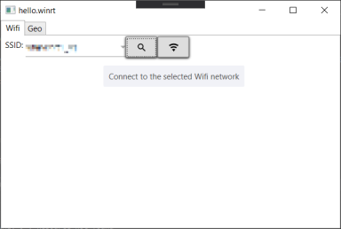
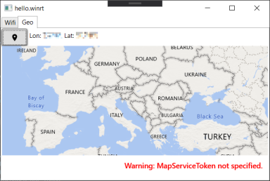
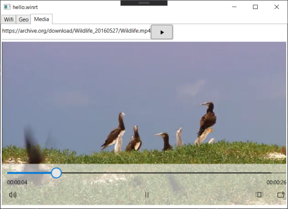
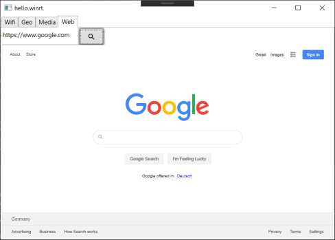

# hello.winrt

Using WinRT APIs from a netcore3 WPF application.

## Features

### Wifi

### GeoLocator & MapControl

**NOTE:** You need to `Allow desktop apps to access your location`, cf.:

- [How to Turn On or Off Location Access for Desktop apps in Windows 10](https://www.tenforums.com/tutorials/138191-turn-off-location-access-desktop-apps-windows-10-a.html)
- [Windows 10 desktop apps and privacy](https://support.microsoft.com/en-us/help/4468234/windows-10-desktop-apps-and-privacy)

### MediaPlayer

### WebView

## References

- [Calling Windows 10 APIs From a Desktop Application just got easier](https://blogs.windows.com/windowsdeveloper/2019/04/30/calling-windows-10-apis-from-a-desktop-application-just-got-easier/)
- [Call UWP APIs in desktop apps](https://docs.microsoft.com/en-us/windows/apps/desktop/modernize/desktop-to-uwp-enhance)
- Using XAML Islands on Windows 10 19H1: fixing the "Catastrophic failure" exception: [2) Add an application manifest](https://techcommunity.microsoft.com/t5/windows-dev-appconsult/using-xaml-islands-on-windows-10-19h1-fixing-the-quot/ba-p/376330#add-an-application-manifest)
- [Announcing .NET Core 3.0](https://devblogs.microsoft.com/dotnet/announcing-net-core-3-0/)
- [.NET Core 3: Use UWP Controls in WPF with XAML Islands](https://www.thomasclaudiushuber.com/2019/04/23/net-core-3-use-uwp-controls-in-wpf-with-xaml-islands/)
- [Xaml Island: Wpf & Windows Forms](https://basta.net/blog/xaml-islands-wpf-und-windows-forms/)
- Microsoft Docs on [Application Manifests](https://docs.microsoft.com/en-us/windows/win32/sbscs/application-manifests)
- [Host UWP XAML controls in desktop apps (XAML Islands)](https://docs.microsoft.com/en-us/windows/apps/desktop/modernize/xaml-islands)
- [Microsoft.Toolkit.Sample.Wpf.App/MainWindow.xaml](https://github.com/windows-toolkit/Microsoft.Toolkit.Win32/blob/master/Microsoft.Toolkit.Sample.Wpf.App/MainWindow.xaml)
